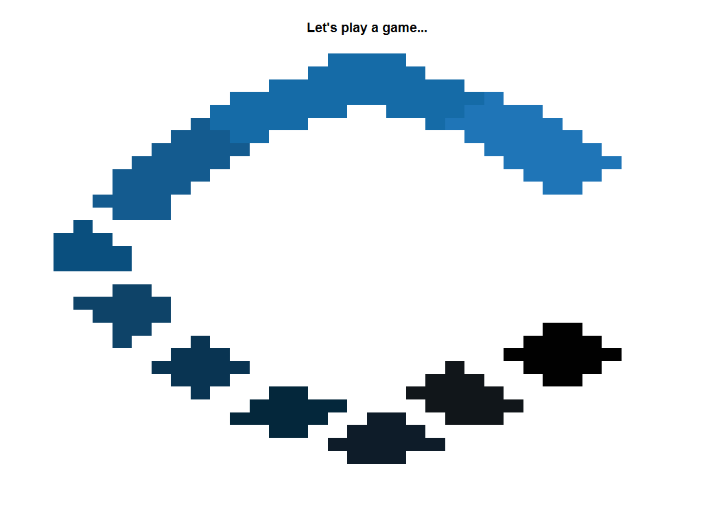
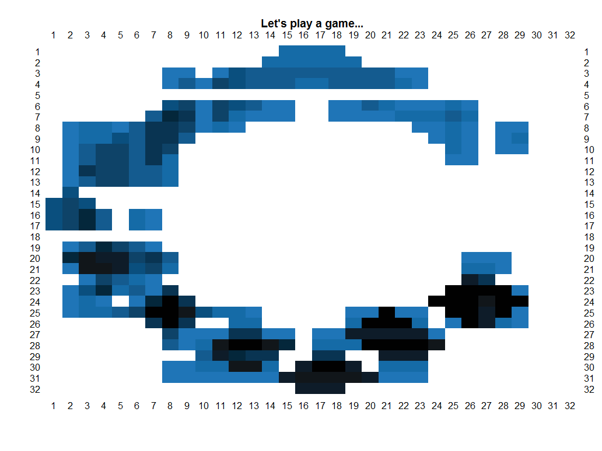
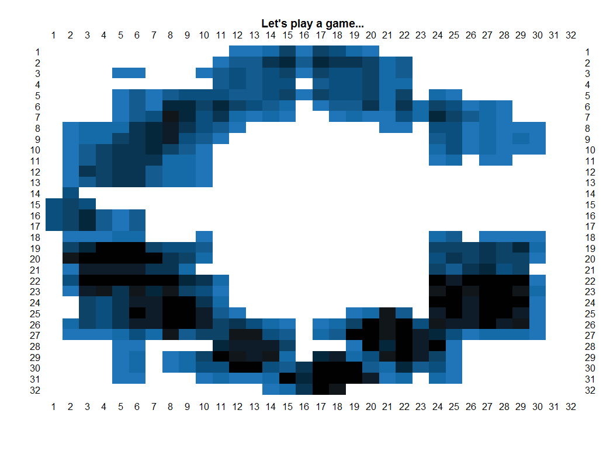

Fruit ninja--in R!

SUMMARY: During my stint at a startup called Captricity, every quarter we are given 1 week called Challenge Week where we can build anything we want. This is 1st of 3 games I built for Captricity that visualizes something that felt important or fun. In Shreddr.R, we get to slice the Captricity logo like Fruit Ninja--in fact, the color scheme is true to the logo as I asked the Head Designer for the exact hexadecimal encoding of the colors. This game is legit!  

HOW TO RUN IT: Just fork and clone the repo and run the entire code. Then, type "play.shreddr()" and then you can play the game. You can slice vertically and horizontally.  
 
After the first slice, you will see number indices demarcating where the slices will take place. The idea behind this game is that wherever you slice, you are moving the color pigments to adjacent tiles. The darkest pigments when sliced will become a lighter color. The lightest pigments will become white when sliced again. Upon slicing an index to slice, pigments will move left and right twice to simulate animation--it is as if you had a hot knife through pigment butter!
 
Slice to your hearts content.

MOTIVATION: At Captricity, there was Challenge Week, and I wanted to build games that visualize an important aspect at Captricity. At Captricity, the main language is Python, and I'm quicker to prototype in R. Hence, I built Shreddr in R.  

CHALLENGES:  
1) LOGO DESIGN: I had to estimate the shape and get the color of the Captricity logo.  

2) MATRIX ORIENTATION: The first thing that perplexed me is that when I created a matrix in R and then call the image() function on it, the image had the incorrect orientation. I don't remember if the image was flipped or rotated, but it made it difficult to manually test and code to slice the pigments.  

SOLUTIONS:
1) LOGO DESIGN: I estimated the shape based on what 32 by 32 pixels can draw. I asked the Lead Designer for the actual hexadecimal colors.
NOTES

